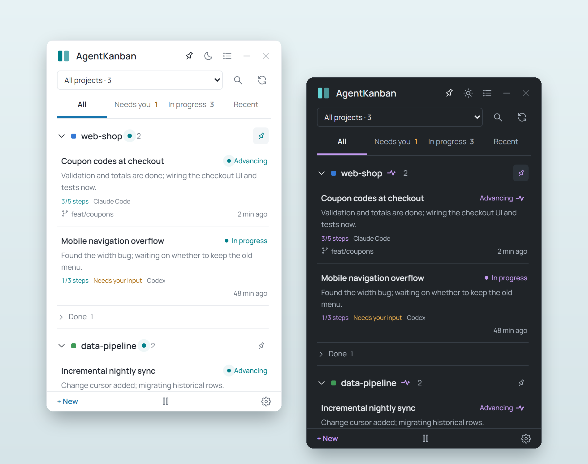
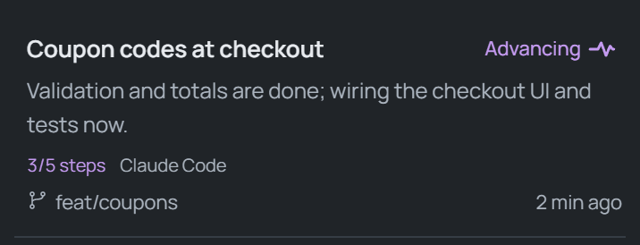
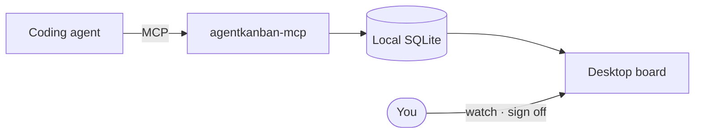
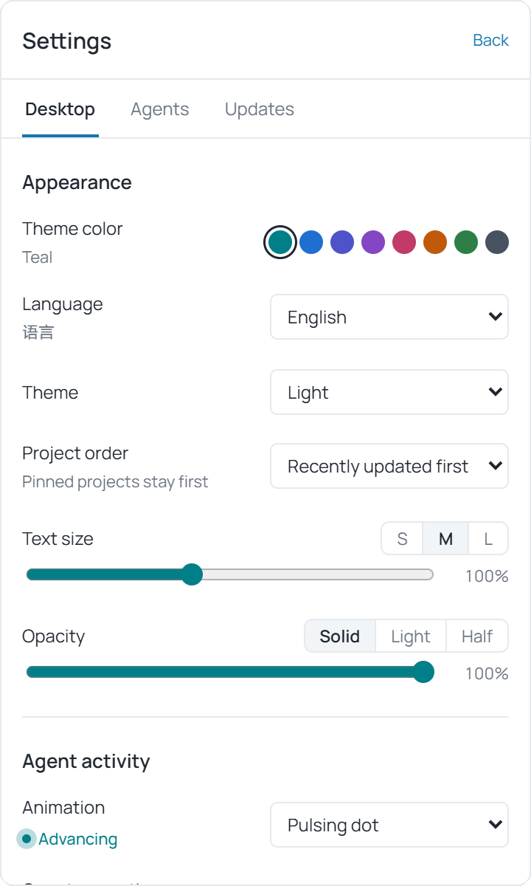

<div align="center">


# AgentKanban

**A desktop task board your coding agents keep up to date themselves**

Agents do the work. You sign off.

[](https://github.com/keviccz/AgentKanban/releases)
[](https://github.com/keviccz/AgentKanban/releases)


[中文](README.md) · **English**

[Download](https://github.com/keviccz/AgentKanban/releases/latest) · [Quick start](#quick-start) · [Connect an agent](#supported-clients) · [Manual (Chinese)](docs/USAGE.md) · [FAQ](#faq)



</div>

---

Run a few coding agents at once and you soon lose track of who is doing what, how far along it is, and what is waiting on you. AgentKanban is a small always-on-top window: through a local MCP server, **agents register their own tasks, write a plan, and report progress at each milestone**. You glance at it, add a note when needed, and sign off on results.

Everything stays on your machine. It never calls a model API, uploads nothing, and needs no account.

## Highlights

- **Agents track themselves**: tasks that change files show up automatically with a goal, acceptance checks and plan steps. Plain Q&A is skipped; say "don't track this" to skip a task.
- **See who is moving right now**: tasks with a recent report show a live "Advancing" animation, in seven styles such as pulsing dot, heartbeat and spinning ring.
- **Interrupts only when it matters**: notifications for blocked tasks and questions only. Finished tasks turn gray; review is optional, with right-click accept or archive and a 6-second undo.
- **Organized by project**: worktrees of one repository group together. Pin, color-label, rename, archive or block whole projects.
- **Light on context**: 3 MCP tools; a write returns a ~30-token receipt and a search returns 5 summaries by default.
- **Keyboard friendly**: `Ctrl+Alt+K` to show, `Ctrl+Alt+N` to capture, and ↑↓ / Enter / A / E / `/` on the board.
- **Looks good your way**: light, dark or system theme, 8 theme colors, Chinese or English UI, adjustable text size and opacity.
- **Reliable local data**: SQLite with WAL handles several agents writing at once, optimistic locking prevents overwrites; one-click backup, an archive center and a work summary you can copy as Markdown.
- **One-click setup**: writes the MCP config and tracking rules for Codex, Claude Code, Cursor and four more clients, backing up files first.
- **In-app updates**: checks GitHub Releases, verifies the signature and backs up the database before installing.

<div align="center">

</div>

## How it works



- Agents call three stdio MCP tools: `task_list`, `task_upsert` and `task_archive`. Clients start the MCP process on demand, so tasks are recorded even while the board is closed.
- Data lives in `%LOCALAPPDATA%\AgentKanban`; the board sits in the tray and reads the latest state when opened.
- A task is identified by project folder plus `task_key`, so later sessions keep updating the same record.
- Tracking rules live in the tool descriptions and the client's global instructions. Agents update at milestones, real blockers and completion, never per command.

## Quick start

1. **Install**: download `AgentKanban_<version>_x64-setup.exe` from [Releases](https://github.com/keviccz/AgentKanban/releases/latest). It installs per user, no admin rights needed. A portable zip is also available.
2. **Connect**: open the board → Settings → Agents, and click "Connect" next to your client.
3. **Restart the client**, give the agent a small task that edits a file, and watch it appear on the board.

> [!TIP]
> Switch the interface to English in Settings → Desktop → Appearance → Language (it follows Windows by default). An empty board starts with two tutorial samples that you can archive.

## Supported clients

| Client | MCP config | Global rules |
|---|---|---|
| Codex | `~/.codex/config.toml` | `~/.codex/AGENTS.md` |
| Claude Code | `~/.claude.json` | `~/.claude/CLAUDE.md` |
| DeepSeek Harness | `~/.dsh/cordis.patch.yml` | `~/.dsh/AGENTS.md` |
| Cursor | `~/.cursor/mcp.json` | — |
| OpenCode | `~/.config/opencode/opencode.json` | `~/.config/opencode/AGENTS.md` |
| Antigravity | `~/.gemini/config/mcp_config.json` | `~/.gemini/GEMINI.md` |
| Hermes | `~/.hermes/config.yaml` | — |

Any other client with stdio MCP support works too: open "Manual setup" in Settings and copy the snippet. See the [MCP guide (Chinese)](docs/MCP.md).

## A closer look

<div align="center">

</div>

- **Detailed or compact list**, or collapse the board into a strip that shows only counts.
- **Project menu**: color label, rename, archive project, block project.
- **Task details**: full request, plan steps, deliverables, the agent's report history, and a note for the agent.

## FAQ

<details>
<summary><b>Does it call an LLM or upload my code?</b></summary>

No. It stores only the task text agents choose to report, in a local SQLite file, and never calls a model API. The only network access is the optional update check against GitHub Releases.
</details>

<details>
<summary><b>How much agent context does it use?</b></summary>

The three tool descriptions are about 1.5–2k tokens, and clients such as Claude Code and Codex load them on demand. A write receipt is about 30 tokens and a search returns 5 summaries. A typical task costs 3–5k tokens in total, mostly the progress text the agent writes.
</details>

<details>
<summary><b>How do I stop tracking a project, or pause for a while?</b></summary>

Tell the agent "don't track this" to skip one task. Right-click a project and choose "Block project" and every later call for it is told the project is blocked. The pause button in the footer pauses all recording while agents keep working.
</details>

<details>
<summary><b>An agent quit but its task still says "Advancing"?</b></summary>

"Advancing" only looks at the last report time (within 30 minutes by default); after that it falls back to "In progress". The board does not check whether an agent is alive, and a crashed agent is never marked done.
</details>

<details>
<summary><b>macOS or Linux?</b></summary>

Only Windows builds are published. The core and MCP server are Rust and the shell is Tauri, so a port is plausible, but the tray, shortcuts, notifications and installer are only tested on Windows.
</details>

<details>
<summary><b>Where is my data and how do I back it up?</b></summary>

In `%LOCALAPPDATA%\AgentKanban\agentkanban.sqlite3` by default. Settings → Desktop → Cleanup → "Back up now" writes a complete copy, even while agents are writing.
</details>

## Build from source

Requires Windows, Node.js, Rust (MSVC toolchain), Visual Studio C++ Build Tools and the WebView2 Runtime.

```powershell
npm ci
npm run desktop:dev      # dev mode: prepares the MCP server and opens the window
npm run desktop:build    # installer and portable zip in release/
npm run desktop:update   # build and install over the local copy, keeping data
```

`npm run dev` is a browser-only layout preview; open `http://127.0.0.1:1420/?demo&lang=en` for sample data (add `&theme=dark` for the dark theme).

```text
crates/kanban-core   data model, SQLite, project identity (Rust)
crates/kanban-mcp    stdio MCP server and fallback CLI entry (Rust)
src-tauri            desktop shell: tray, window, notifications, updates, client setup (Tauri 2)
src                  board UI (React 19 + TypeScript)
```

## Documentation

The detailed docs are in Chinese:

- [User manual](docs/USAGE.md): every feature, client setup, data and limits
- [MCP guide](docs/MCP.md): tool contract, disconnects, pause and block
- [Agent tracking rules](docs/AGENT_RULES.md)
- [Updates and releases](docs/UPDATES.md): signed builds and GitHub draft releases
- [Verification log](docs/VERIFICATION.md)
- [Release notes](docs/RELEASE_NOTES.md)

## Acknowledgements

- [Tauri](https://tauri.app), [React](https://react.dev), [rusqlite](https://github.com/rusqlite/rusqlite)
- Fonts: [Manrope](https://github.com/sharanda/manrope) and [Geist Mono](https://github.com/vercel/geist-font) (SIL OFL); Chinese text uses [HarmonyOS Sans](https://developer.huawei.com/consumer/cn/design/resource/), bundled unmodified under its license (full text in `src/fonts/`)
