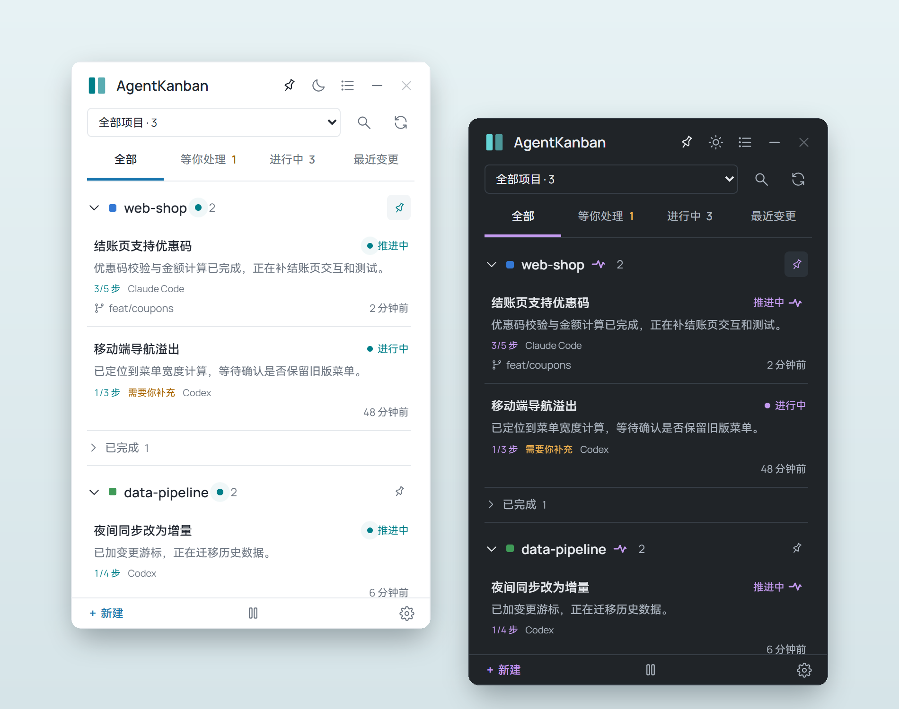
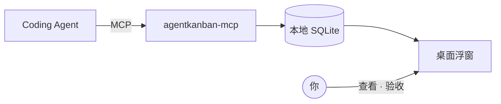
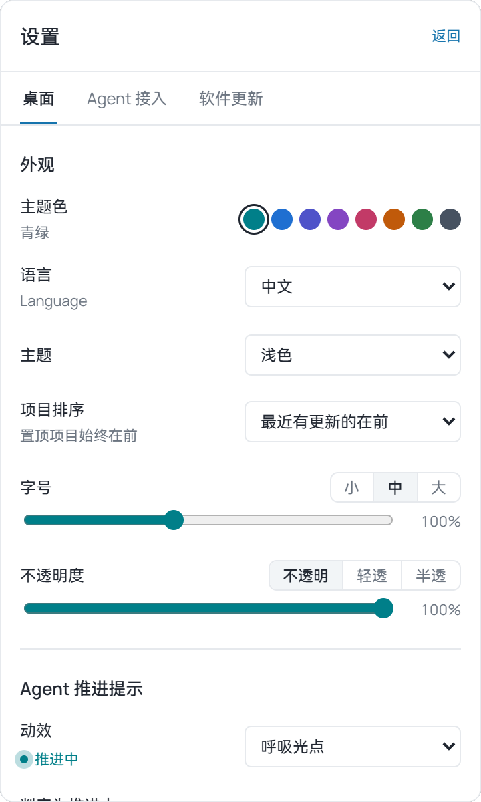

<div align="center">


# AgentKanban

**让 Coding Agent 自己记账的桌面任务浮窗**

Agent 推进，你来验收。

[](https://github.com/keviccz/AgentKanban/releases)
[](https://github.com/keviccz/AgentKanban/releases)


[](LICENSE)

**中文** · [English](README.en.md)

[下载](https://github.com/keviccz/AgentKanban/releases/latest) · [快速开始](#快速开始) · [接入 Agent](#支持的客户端) · [使用手册](docs/USAGE.md) · [常见问题](#常见问题)



</div>

---

同时开着几个 Coding Agent，很快就记不清谁在做什么、做到哪一步、哪件事在等你。AgentKanban 是一个常驻桌面的小浮窗：Agent 通过本地 MCP **自己登记任务、写计划、在阶段完成时更新进度**，你只需要瞄一眼，并在需要时补充意见或验收。

它完全在本机运行：不调用任何模型 API，不上传数据，也不需要账号。

## 功能亮点

- **Agent 自动入板**：会修改文件的任务自动出现在看板上，带目标、验收标准和计划步骤；普通问答不记，说一句「不用记」即可跳过。
- **一眼看到谁在推进**：最近有上报的任务显示「推进中」动效，提供呼吸光点、心电波形、旋转光环等 7 种样式。
- **需要你时才打扰**：只有受阻或需要你补充时才弹通知；完成的任务直接变灰，验收可选，右键一键验收或归档，6 秒内可撤销。
- **按项目组织**：同一仓库的 worktree 自动归到一起；项目可置顶、加颜色标签、重命名、归档或整个屏蔽。
- **轻量省上下文**：MCP 只有 3 个工具，写入只返回约 30 个 token 的回执，查询默认返回 5 条摘要。
- **键盘友好**：`Ctrl+Alt+K` 呼出、`Ctrl+Alt+N` 快速新建，看板内 ↑↓ / Enter / A / E / `/` 操作。
- **好看且可定制**：浅色 / 深色 / 跟随系统，8 种主题色，中文 / English 界面，可调字号和透明度。
- **可靠的本地数据**：SQLite + WAL 支持多个 Agent 并发写入，乐观锁防止覆盖，一键备份、归档中心、工作摘要可复制为 Markdown。
- **一键接入**：Codex、Claude Code、Cursor 等 7 个客户端一键写入配置和同步规则，原文件先备份。
- **应用内更新**：检查 GitHub Releases，签名校验后安装，安装前自动备份数据库。

<div align="center">

</div>

## 工作原理



- Agent 通过 stdio MCP 调用 `task_list` / `task_upsert` / `task_archive` 三个工具；MCP 进程由客户端按需启动，浮窗不开也能记录。
- 数据保存在本机 `%LOCALAPPDATA%\AgentKanban`，浮窗常驻托盘，打开时读取最新状态。
- 任务按「项目目录 + task_key」定位，Agent 在后续会话里会继续更新同一条记录。
- 同步规则写在工具说明和客户端的全局指令文件里，Agent 只在阶段完成、真实受阻或全部完成时更新，不会逐条命令刷屏。

## 快速开始

1. **下载安装**：从 [Releases](https://github.com/keviccz/AgentKanban/releases/latest) 下载 `AgentKanban_<版本>_x64-setup.exe`，按当前用户安装，无需管理员权限。也提供免安装的 zip 包。
2. **一键接入**：打开浮窗 → 设置 → Agent 接入，在你用的客户端旁点「一键接入」。
3. **重启客户端**，让 Agent 做一件会修改文件的小事，看它出现在看板上。

> [!TIP]
> 首次打开空看板时会有两条教学示例，演示「推进中」和「验收」。示例可以直接归档。

## 支持的客户端

| 客户端 | MCP 配置 | 全局规则 |
|---|---|---|
| Codex | `~/.codex/config.toml` | `~/.codex/AGENTS.md` |
| Claude Code | `~/.claude.json` | `~/.claude/CLAUDE.md` |
| DeepSeek Harness | `~/.dsh/cordis.patch.yml` | `~/.dsh/AGENTS.md` |
| Cursor | `~/.cursor/mcp.json` | — |
| OpenCode | `~/.config/opencode/opencode.json` | `~/.config/opencode/AGENTS.md` |
| Antigravity | `~/.gemini/config/mcp_config.json` | `~/.gemini/GEMINI.md` |
| Hermes | `~/.hermes/config.yaml` | — |

其他支持 stdio MCP 的客户端，可在设置里展开「手动配置」复制片段。详见 [MCP 接入说明](docs/MCP.md)。

## 界面一览

<div align="center">

</div>

- **详细 / 简洁两种视图**，也能收成只显示计数的窄条。
- **项目右键菜单**：颜色标签、重命名、归档项目、屏蔽项目。
- **任务详情**：完整需求、计划步骤、交付物、Agent 上报记录，以及给 Agent 的补充意见。

完整功能说明见 [使用手册](docs/USAGE.md)。

## 常见问题

<details>
<summary><b>会调用大模型或上传我的代码吗？</b></summary>

不会。AgentKanban 只保存 Agent 主动上报的任务文字，数据在本机 SQLite，应用本身不调用任何模型 API。唯一的联网行为是可选的检查更新（GitHub Releases）。
</details>

<details>
<summary><b>会占用 Agent 多少上下文？</b></summary>

3 个工具的说明约 1.5–2k token，且 Claude Code、Codex 等客户端按需加载；写入回执约 30 token，查询默认 5 条摘要。一个典型任务总计约 3–5k token，主要是 Agent 自己写的进展文字。
</details>

<details>
<summary><b>不想记录某个项目，或者暂时不想记录？</b></summary>

对 Agent 说「这个不用记」可跳过单个任务；右键项目选「屏蔽项目」后，该项目之后的所有调用都会被告知已屏蔽；底栏的暂停按钮可临时暂停全部记录，Agent 照常工作。
</details>

<details>
<summary><b>Agent 退出了，任务还显示「推进中」？</b></summary>

「推进中」只看最近一次上报时间（默认 30 分钟内），超过就回到普通的「进行中」。看板不做存活检测，Agent 意外退出不会被自动标记为完成。
</details>

<details>
<summary><b>支持 macOS / Linux 吗？</b></summary>

目前只发布 Windows 版本。核心与 MCP 用 Rust 编写，桌面端基于 Tauri，理论上可移植，但托盘、快捷键、通知和安装流程只在 Windows 上验证过。
</details>

<details>
<summary><b>数据存在哪里，怎么备份？</b></summary>

默认在 `%LOCALAPPDATA%\AgentKanban\agentkanban.sqlite3`。设置 → 桌面 → 整理中可以「立即备份」，运行中也能得到完整副本。
</details>

## 从源码构建

需要 Windows、Node.js、Rust（MSVC 工具链）、Visual Studio C++ Build Tools 和 WebView2 Runtime。

```powershell
npm ci
npm run desktop:dev      # 开发模式：准备 MCP 并启动桌面窗口
npm run desktop:build    # 构建安装包和免安装包到 release/
npm run desktop:update   # 构建并覆盖安装到本机，数据保留
```

`npm run dev` 只做浏览器布局预览；访问 `http://127.0.0.1:1420/?demo` 可看到演示数据（加 `&theme=dark&lang=en` 切换主题和语言）。

```text
crates/kanban-core   数据模型、SQLite、项目识别（Rust）
crates/kanban-mcp    stdio MCP 服务与备用 CLI 入口（Rust）
src-tauri            桌面壳：托盘、窗口、通知、更新、客户端接入（Tauri 2）
src                  浮窗界面（React 19 + TypeScript）
```

## 文档

- [使用手册](docs/USAGE.md)：全部功能、接入细节、数据与边界
- [MCP 接入说明](docs/MCP.md)：工具契约、断线处理、暂停与屏蔽
- [Agent 同步规则](docs/AGENT_RULES.md)
- [更新与发布](docs/UPDATES.md)：签名构建与 GitHub 草稿发布
- [验收记录](docs/VERIFICATION.md)
- [版本说明](docs/RELEASE_NOTES.md)

## 许可证

代码以 [MIT](LICENSE) 许可证开源。内置字体各自遵循其许可：Manrope 与 Geist Mono 为 SIL OFL，HarmonyOS Sans 按其许可协议原样分发（协议全文见 `src/fonts/`），不在 MIT 范围内。

## 致谢

- [Tauri](https://tauri.app)、[React](https://react.dev)、[rusqlite](https://github.com/rusqlite/rusqlite)
- 字体：[Manrope](https://github.com/sharanda/manrope) 与 [Geist Mono](https://github.com/vercel/geist-font)（SIL OFL），中文使用 [HarmonyOS Sans](https://developer.huawei.com/consumer/cn/design/resource/)（按其许可协议原样打包，协议全文见 `src/fonts/`）
